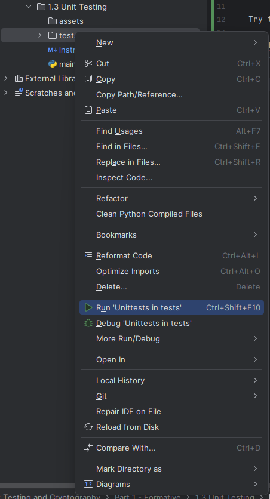
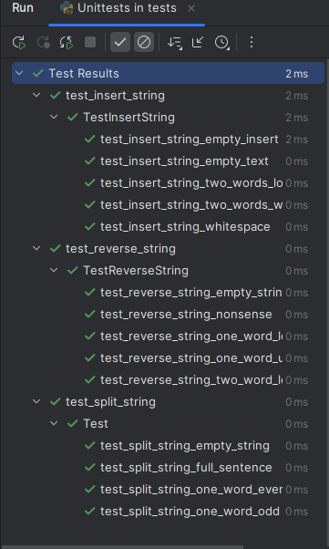

# Unit Testing

In this section, you will learn how to create and run simple unit tests using the unittest module.
Unit testing is a common way to actively test your code throughout the development process.
It is named 'unit' testing because you are testing individual units within your program.

Let's start by taking a look at the main.py file within this lesson. You do not need to edit this file!
Here we have 3 functions that manipulate strings.
Notice that nothing happens when you run the code. 
However, the code is still being tested!

Try the following:

Right-click on the 'tests' directory in 1.3 and press 'Run Unittests tests'

You will get a window at the bottom that displays the tests. Click the check icon to see all passed tests.

Next, take a look at the files in the tests folder. Notice how all of the testing file start with 'test'.
Whenever you create tests for unit testing you should always start the name of the file with 'test' followed by the function or class you are testing.
Inside ech of the files is a class that holds all of our test cases. Each test case is broken down into its own method within the class.
Notice how the test cases are crafted. They are meant to test each of the functions from all different angles.
A good rule of thumb when writing unit tests is to test ONE, NONE, and MANY. For example, see how one test in each of the files checks if the code still works even if there is an empty string.

The assertEqual method normally takes 2 parameters. The first is the actual value while the second is the expected value.

## Your Job
For this part you will need to go back into 1.1 and 1.2 and add unit testing for all the functions you created.
Use the examples in this folder as a guide when creating the unit tests for your previous code and ***make sure to test it from all angles!***

### Notice
From this point on, you will be required to write unit tests for just about everything we will do this semester including writing test for the second part of the unit!